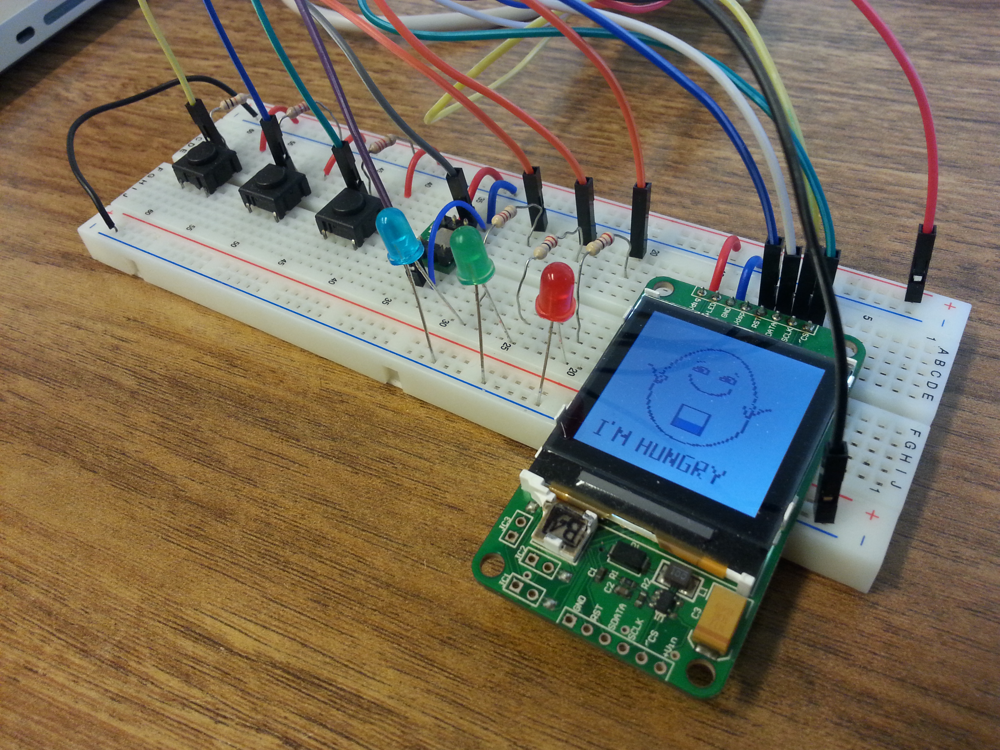

# Structure and Interpretation of Computer Programs: Tamagotchi Project (Scheme)

This repo contains the project that I did in December 2014 for the ["Structure and Interpretation of Computer Programs" course](http://soft.vub.ac.be/soft/content/structure-and-interpretation-computer-programs-taught-english) teached by Prof. De Meuter at the *Vrije Universiteit Brussel*. This course covered a great part of the excellent [SICP book](https://mitpress.mit.edu/sicp/). The goal of the course was to get a "deep understanding of how programming languages work". It covered among others the following subjects: functional (higher order) programming, closure, anonymous functions, continuation, meta-programming (meta-circularity) and lambda calculus.

To code in Scheme, the following interpreter is recommended: [DrRacket](https://racket-lang.org/)

A video of the project is available on [Youtube](https://www.youtube.com/watch?v=Hlp28RsC6tg).

## Project

The project consisted to build a tamagotchi and program it in Scheme. The hardware given to us consisted of an Olimex LPC-H2214 microcontroller, an LCD screen, a protoboard, a USB cable, 3 leds, 3 buttons, 1 accelerometer, some resistors and some wires. I used the [ZTerm terminal emulator](http://www.dalverson.com/zterm/) to load my code on the board.

Here is what my final project looked like:

The instructions were to make it as much as possible similar to a real tamagotchi; that is, the monster should display its state (hungry, sleepy, sick,...) and we should be able to interact with it (by feeding it, playing with it, etc).

Here are few other pictures showing the final project:

In addition to code the whole program for the tamagotchi, I also wrote the libraries to draw the various shapes and letters/integers. This code can be found in the init.scm file in the src folder. The other file (ArmSchemeLib.scm) defines some low-level commands and was provided to us by the teaching staffs.

A video of the project is available on [Youtube](https://www.youtube.com/watch?v=Hlp28RsC6tg).

### Personal notes

This course was very interesting. I learned many new concepts (continuation, meta-programming,...) and a new programming paradigm (= functional paradigm).